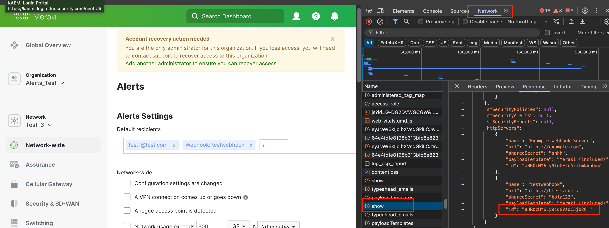

## Script Meraki API Alerts

This project contains a Python script using Meraki library to automate the way Alerts are modified, created, updated. It also includes a function to create and validate Webhooks.

### Features

- Filter by organizations and networks
- Validation of changes
- Validation of webhook
- dry run 
- Logs

### Requirements

- Python3
- `API key` 
- JSON config template

### Use
- It is recommended to save the JSON config template in the same folder as the script. You will need this PATH in order to tell the program where to find it. 
- If you want to use the webhook in the field [email], then you will first need to create the webhook and then get its ID through another API `[dashboard.networks.getNetworkWebhooksHttpServer]` request or Inspect mode in browser. 

